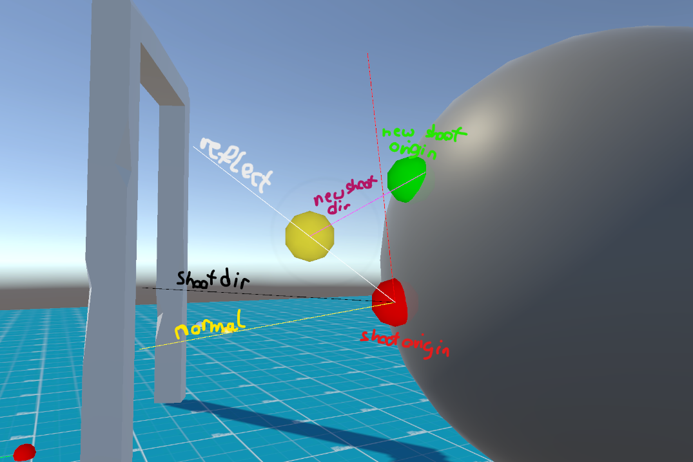

# Ivy Generator (WIP)
### Keep in mind temporary it uses 2D line renderer and that's why there are some visual bugs.
 [IvyGeneration.webm](https://github.com/user-attachments/assets/b97e6d59-7a99-47b8-8017-b55f7142e38b)

### How this loop works?
From random starting position and random angle it chooses point of $${\color{red}shootOrigin}$$ and then if $${\color{yellow}normal}$$ is not flat surface then it reflects and takes step back and check's different angles,tilts for choosing best one possible in image this is represented via $${\color{magenta}newShootDir}$$.
Next this system checks from $${\color{red}shootOrigin}$$ to $${\color{green}newShootOrigin}$$ in straight line if there is any obstacle, if there is then it creates in between point in order to avoid ivy clip into mesh.
Repeat that process for many times and you will get resoult that is represented on image.

#### RoadMap:
:heavy_check_mark: Ivy points generation with gizmos visualisation  
:heavy_check_mark: Ivy using 2D line renderer  
:heavy_check_mark: Ivy avoidance clipping into mesh  
:heavy_check_mark: First visualization demo  
- [ ] Ivy using 3D line renderer (when I finish doing 3D line renderer)
- [ ] Optimalisation using Unity Jobs and Advanced Mesh API with Multi-Stream Approach, <a href="https://catlikecoding.com/unity/tutorials/procedural-meshes/creating-a-mesh/">great blog about that</a>
- [ ] Show ball throwing and from ball impact create vines
- [ ] VFX's
- [ ] Shaders for better visuals

### Plugins used:
#### URP, Zenject,Cinemachine,InputSystem,DOTween,Probuilder
